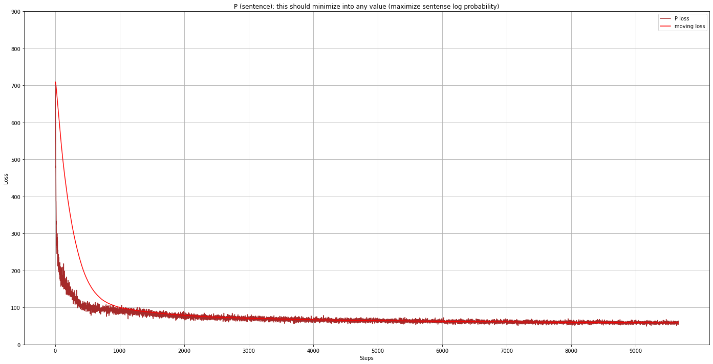
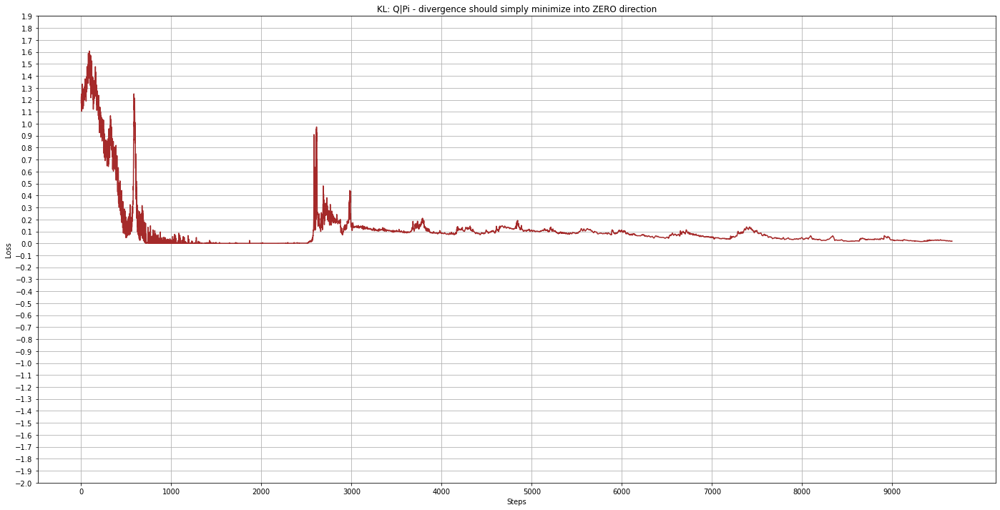

# crsal
Implementation of CRSAL: Conversational recommender systems with adversarial learning

1. https://repository.kaust.edu.sa/bitstream/handle/10754/665725/TOIS.pdf

THIS IS A DRAFT IN PROGRESS

Other papers:

2. Latent Intention Dialogue Models
https://arxiv.org/abs/1705.10229 

3. Neural Belief Tracker: Data-Driven Dialogue State Tracking
https://arxiv.org/abs/1606.03777

Notes:

- Papers (2) & (3) have implementation and are close to the crsal
- There are many other papers CRSAL is based on. They are all mentioned in the paper
- My objective is to make it work with some results close to what is in the paper, but I am interested next in multir-case, multir-domain and multi-dialogue type problem
- Information richness indicator shows how much information has been provided and probably important for the model to conclude the conversation. LIDM (2) uses DB query for this, this paper counts how many times slots were mentioned
- I do not see how NRN is used. It is depicted in the paper, but it's not hooked in in any way during sentence generation. Language model produces the whole answer without NRN. in LIDM (2), there is no such thing.
- I used GRU instead of LSTM (for now)

To do:
- Model trained in unsupervised mode. Clustering is not done
- Reinforcement learning to improve policy is not done
- Performance Tests
- Interactive case play
- Rewrite data preparation. I use and modified nbt from (3)

Commands:

DST

Train:
python training.py --action=TRAIN_DST --config=config/config.v01

Test:
time python training.py --action=TEST_DST --config=config/config.v01

Predict:
python training.py --action=PREDICT_DST --config=config/config.v01

The rest of the network without Reinforcement Learning:

Train:
python training.py --action=TRAIN_VIN --config=config/config.v01

Training samples:

Language model loss

KL loss

